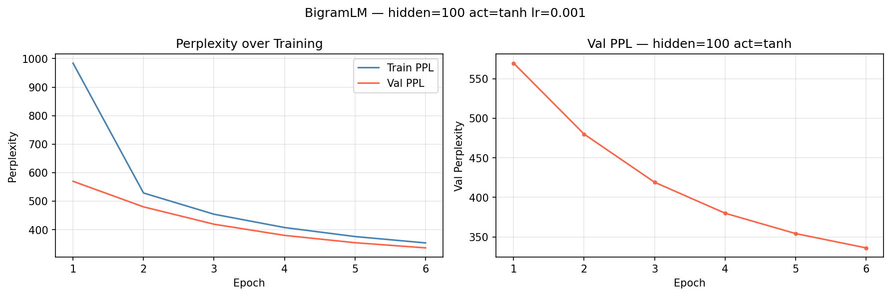

# Neural Bigram Language Model

A neural language model built from scratch in PyTorch that predicts the next word using Word2Vec embeddings. Includes an interactive Streamlit demo for next-word prediction, text generation, and sentence scoring.

**Result**: Natural sentences score **4.9x lower perplexity** than word-shuffled versions, demonstrating the model has learned word order patterns.

---

## Demo

Try the live demo: **[Launch App →](https://your-app.streamlit.app)** *(update after deployment)*

| Feature | Description |
|---|---|
| Next Word Prediction | Enter 1–2 words, see top-N most likely continuations with probabilities |
| Text Generation | Provide seed words, sample sentences at adjustable temperature |
| Sentence Scoring | Compare perplexity of two sentences — natural vs. shuffled |

---

## Architecture

```
Input:  [word_{t-2} embedding ‖ word_{t-1} embedding]   (200-dim)
Hidden: Linear(200 → 100) + Tanh
Output: Linear(100 → 29,943)  →  softmax  →  P(next word)
```

- **Embeddings**: Pretrained Word2Vec vectors (100-dim), trained on a 26M-token corpus
- **Context**: 2 previous words (bigram window)
- **Vocabulary**: 29,943 words
- **Parameters**: 3,044,343
- **Training objective**: Cross-entropy loss (next-word prediction)
- **Optimizer**: Adam (lr=1e-3)

---

## Training

Trained for 30 epochs on 10,000 sentences (212,031 training examples).

| Metric | Value |
|---|---|
| Test Perplexity | **452.64** |
| Natural PPL | 452.64 |
| Shuffled PPL | 1,509.35 |
| Shuffled / Natural | **3.3×** |



Val perplexity decreases consistently across 30 epochs with no sign of overfitting, indicating the model is still underfitting (expected for a bigram model on a large vocabulary).

---

## Sentence Scoring Example

The model correctly assigns lower perplexity to natural word order:

| Sentence | Perplexity |
|---|---|
| "the stock market rose sharply today" | **619.2** |
| "sharply today market rose stock the" | 3022.3 |

Natural sentence is **4.9× more natural** according to the model.

---

## Project Structure

```
neural-language-model/
├── data.py               # Data loading: Word2Vec embeddings + sentence examples
├── model.py              # PyTorch BigramLM definition
├── train.py              # Training loop, perplexity evaluation, experiment logging
├── app.py                # Streamlit interactive demo
├── best_model.pt         # Trained model weights (30 epochs)
├── training_curves.png   # Train/val perplexity over epochs
├── training_log.csv      # Per-epoch metrics
├── test_result.txt       # Final test perplexity
└── requirements.txt
```

---

## How to Run

```bash
git clone https://github.com/GuanghuaSun/neural-language-model.git
cd neural-language-model

pip install -r requirements.txt

# You need vec.txt and sentence files from the original dataset
# Place them in the project root before running

# Train from scratch (optional — best_model.pt already included)
python train.py --epochs 30 --hidden 100 --activation tanh

# Launch interactive demo
streamlit run app.py
```

> **Note**: `vec.txt` (28MB Word2Vec embeddings) and sentence files are excluded from this repo due to size. The pretrained `best_model.pt` is included so the Streamlit demo runs without retraining.

---

## Key Implementation Details

**Perplexity** (standard NLP evaluation metric):
```
PPL = exp(average negative log-likelihood)
```
Lower PPL = model finds the text more probable = more natural.

**Natural vs. Shuffled validation**: For each test sentence, a word-shuffled version is created and both are scored. A well-trained language model should consistently assign lower PPL to the natural order — confirmed at 3.3× ratio.

**Temperature sampling** in text generation:
```
logits_scaled = logits / temperature
probs = softmax(logits_scaled)
```
Lower temperature (< 1.0) → more conservative, picks high-probability words.
Higher temperature (> 1.0) → more random, diverse outputs.

---

## Tech Stack

- Python 3
- PyTorch
- NumPy
- Streamlit
- Matplotlib
